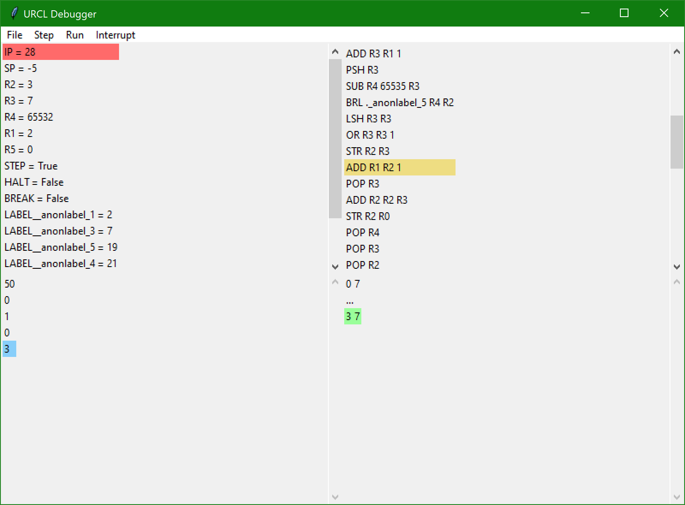

# What is URCL Toolkit?
URCL Toolkit is a collection of programs and libraries for creating, manipulating, and compiling URCL assembly.

# debugger.py
A debugger for stepping through and executing URCL code or compiled urclpy modules.
## Usage
```
python debugger.py input.urcl
```
```
python debugger.py input.py
```
# assembler.py
This is an example program that creates a debugger-compatible module from one or more URCL files.
## Usage
```
python assembler.py inputA.urcl inputB.urcl -o output.py
```
# demo.py
This is an example program that creates a debugger-compatible module using the URCL Emitter API.
```py
from urcl import *

#Create linked list class.
linkedListClass = Class("LinkedList", None, [Field(PENDING, "Next"), Field(WORD, "Value")])
linkedListClass.Fields[0].Type = linkedListClass

#Configure emitter.
ext = "py"
from urclpy import PythonEmit
emitter = Emitter(emitTarget=PythonEmit(useDebugger=True), memoryManagerMaxAddress=65535, inlineMemoryManagement=False)

#Allocate registers for variables.
nodeA = emitter.NewRegister()
nodeB = emitter.NewRegister()
nodeC = emitter.NewRegister()

#Allocate objects in memory.
emitter.NewObject(linkedListClass, nodeA)
emitter.NewObject(linkedListClass, nodeB)
emitter.NewObject(linkedListClass, nodeC)

#Set object fields.
emitter.EmitSetObjectField(nodeA, 0, nodeB)
emitter.EmitSetObjectField(nodeA, 1, 1)
emitter.EmitSetObjectField(nodeB, 0, nodeC)
emitter.EmitSetObjectField(nodeB, 1, 2)
emitter.EmitSetObjectField(nodeC, 0, ZERO)
emitter.EmitSetObjectField(nodeC, 1, 3)

emitter.Emit(HLT)

outputFile = "./build/output." + ext
#Compile and save.
import os
os.makedirs(os.path.dirname(outputFile), exist_ok=True)
with open(outputFile, "w") as file:
    file.write(str(emitter))
```
# urcl.py
The main URCL processing library and API.
## Usage
```py
from urcl import *
```
# urclpy.py
A module containing the Python source emitter.
## Usage
```py
from urclpy import PythonEmit
emitter = Emitter(emitTarget=PythonEmit())
```
# urclc.py
A module containing the C source emitter.
## Usage
```py
from urclpy import CEmit
emitter = Emitter(emitTarget=CEmit(ramSize=1024, stackSize=1024))
```
# urcl86.py
A module containing the x86-16/32/64 source emitter.
## Usage
```py
from urcl86 import X86Emit
emitter = Emitter(emitTarget=X86Emit())
```